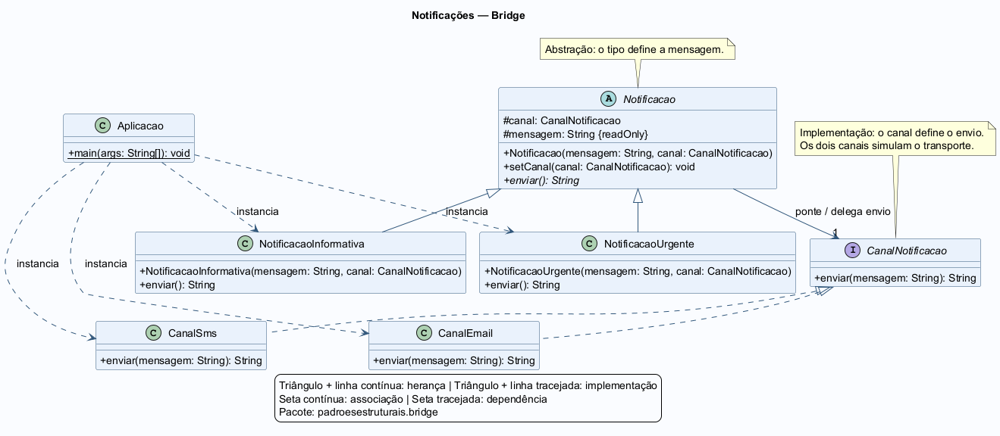

# Padrão Bridge

Projeto desenvolvido para demonstrar a utilização do padrão de projeto **Bridge** em Java.

## 📌 Sobre o projeto

O projeto simula um sistema de **notificações com diferentes tipos de mensagem e canais de envio**.

O padrão Bridge é utilizado para separar o tipo de notificação do canal responsável pelo envio, permitindo que essas duas partes evoluam de forma independente.

Neste projeto existem dois tipos de notificação:

- **Notificação Informativa**
- **Notificação Urgente**

E dois canais de envio:

- **E-mail**
- **SMS**

Qualquer tipo de notificação pode ser combinado com qualquer canal. O envio é simulado por meio do retorno de uma mensagem formatada, exibida no console pela aplicação.

## 🧩 Padrão Bridge

O **Bridge** é um padrão de projeto estrutural que separa uma abstração de sua implementação, permitindo que ambas variem de forma independente.

Neste projeto, a classe abstrata `Notificacao` representa a abstração e mantém uma referência à interface `CanalNotificacao`, que define o contrato dos canais de envio.

As subclasses de `Notificacao` determinam como a mensagem será formatada. As implementações de `CanalNotificacao` determinam como o canal será identificado no envio simulado.

Dessa forma:

```text
NotificacaoInformativa
        ├── CanalEmail
        └── CanalSms
```

E:

```text
NotificacaoUrgente
        ├── CanalEmail
        └── CanalSms
```

Essas combinações são feitas por composição: cada notificação recebe um canal. Assim, não é necessário criar uma classe específica para cada combinação entre tipo de notificação e canal de envio.

## 📁 Estrutura do projeto

```text
Padr-o-Bridge/
│
├── docs/
│   └── diagrama.png
│
├── src/
│   ├── main/
│   │   └── java/
│   │       └── padroesestruturais/
│   │           └── bridge/
│   │               ├── Aplicacao.java
│   │               ├── CanalEmail.java
│   │               ├── CanalNotificacao.java
│   │               ├── CanalSms.java
│   │               ├── Notificacao.java
│   │               ├── NotificacaoInformativa.java
│   │               └── NotificacaoUrgente.java
│   │
│   └── test/
│       └── java/
│           └── padroesestruturais/
│               └── bridge/
│                   └── NotificacaoTest.java
│
├── .gitignore
├── pom.xml
└── README.md
```

## ⚙️ Funcionamento

A interface `CanalNotificacao` define o método que os diferentes canais de envio devem implementar:

```java
String enviar(String mensagem);
```

As classes `CanalEmail` e `CanalSms` implementam essa interface e retornam a mensagem recebida com o prefixo correspondente ao canal:

| Canal | Prefixo |
| --- | --- |
| `CanalEmail` | `E-mail: ` |
| `CanalSms` | `SMS: ` |

A classe abstrata `Notificacao` armazena a mensagem e o canal de envio, além de definir o método abstrato `enviar()`.

As subclasses implementam esse método, acrescentando a identificação do tipo de notificação antes de delegar o envio ao canal:

| Tipo de notificação | Identificação |
| --- | --- |
| `NotificacaoInformativa` | `[INFORMAÇÃO]` |
| `NotificacaoUrgente` | `[URGENTE]` |

O método `setCanal()` permite trocar o canal de uma notificação durante a execução, mantendo a mesma mensagem e o mesmo tipo de notificação.

A implementação também valida os dados recebidos:

- Mensagens nulas, vazias ou compostas apenas por espaços em branco são rejeitadas com `IllegalArgumentException` e a mensagem `Mensagem obrigatória`.
- Canais nulos são rejeitados com `IllegalArgumentException` e a mensagem `Canal obrigatório`.
- Uma tentativa de trocar o canal por um valor nulo preserva o canal anterior.

A classe `Aplicacao` demonstra o funcionamento criando notificações informativa e urgente por e-mail e, em seguida, alterando o canal dessas mesmas notificações para SMS.

### Executando a aplicação

Com o **JDK 11 ou superior** e o **Maven** instalados, execute na pasta do projeto:

```bash
mvn compile
java -cp target/classes padroesestruturais.bridge.Aplicacao
```

Saída esperada:

```text
E-mail: [INFORMAÇÃO] Pedido confirmado
E-mail: [URGENTE] Estoque esgotado
SMS: [INFORMAÇÃO] Pedido confirmado
SMS: [URGENTE] Estoque esgotado
```

## 🏗️ Estrutura do Bridge

Os elementos do padrão utilizados no projeto podem ser identificados da seguinte forma:

| Elemento do Bridge | Implementação |
| --- | --- |
| Abstraction | `Notificacao` |
| Refined Abstraction | `NotificacaoInformativa` |
| Refined Abstraction | `NotificacaoUrgente` |
| Implementor | `CanalNotificacao` |
| Concrete Implementor | `CanalEmail` |
| Concrete Implementor | `CanalSms` |
| Client | `Aplicacao` |

Essa organização permite separar a lógica dos tipos de notificação da lógica dos canais de envio. A referência de `Notificacao` para `CanalNotificacao` estabelece a ponte entre essas duas partes.

## 🧪 Testes

O projeto possui testes automatizados utilizando **JUnit 5**.

Os 11 testes da classe `NotificacaoTest` verificam:

- As quatro combinações entre tipos de notificação e canais de envio.
- A troca de canal de uma mesma notificação durante a execução.
- A delegação da mensagem formatada para uma nova implementação de canal.
- A rejeição de canal nulo no construtor.
- A preservação do canal anterior após uma tentativa de troca inválida.
- A rejeição de mensagens nulas, vazias ou compostas apenas por espaços em branco.

Para executar os testes utilizando Maven:

```bash
mvn test
```

## 📊 Diagrama de Classes

O diagrama de classes do projeto está disponível na pasta `docs`.



O diagrama representa a relação entre `Notificacao`, suas subclasses, a interface `CanalNotificacao` e suas implementações de e-mail e SMS.

## 🛠️ Tecnologias utilizadas

- Java 11
- Maven
- JUnit 5
- Padrões de Projeto — Bridge

## 🎯 Objetivo

O objetivo deste projeto é demonstrar de forma prática a aplicação do padrão **Bridge**, separando os tipos de notificação dos canais utilizados para enviá-las.

Com essa abordagem, novos tipos de notificação podem ser adicionados através de subclasses de `Notificacao`, enquanto novos canais podem ser criados através de implementações de `CanalNotificacao`. Essas extensões podem ser feitas de forma independente, reduzindo o acoplamento entre as classes.

## 👨‍💻 Autor

**Felipe Baba**

Projeto desenvolvido para fins acadêmicos, como aplicação prática do padrão de projeto **Bridge**.
